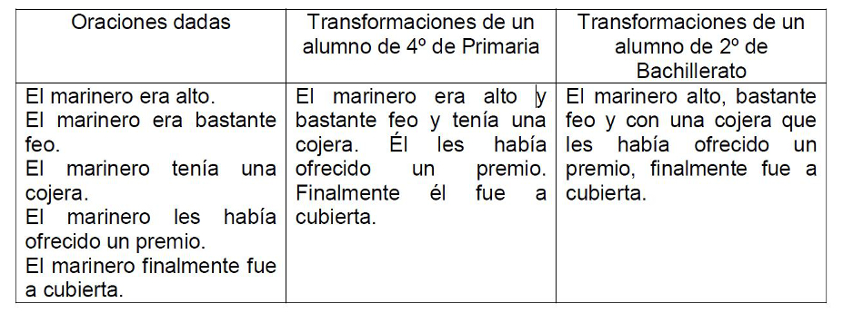

# Una interesante tesis doctoral de lingüística

Desde las fronteras de la investigación lingüística nos llega una tesis doctoral que afirma no haber encontrado correlación entre el tiempo de uso de las TIC (Tecnologías de la Información y la Comunicación, término curiosamente jamás utilizado en la selvática realidad) y la madurez sintáctica, ni diferencias significativas en este ámbito en comparación a generaciones anteriores.

El valor de este texto radica en la investigación que la autora lleva a cabo; se asume que una tesis es una aportación original a un campo y por tanto es, durante un instante, por ser la única, la mejor fuente sobre una materia específica. Que no es la matemática ni la estadística, pues podemos leer “"El 100% de las unidades-t tienen como promedio una cláusula subordinada" [cita verbatim]. Asimismo, la parte experimental se lleva a cabo con tan sólo 191 sujetos; tal vez 31 chicos y 31 chicas de 2ºESO sean insuficientes para dilucidar correlaciones entre la madurez sintáctica y sexo, curso, localización (rural y no urbano) y tipo de centro (privado o público). 

Intuyo que estas comparaciones particulares no sobreviven a una corrección Bonferroni, pero aún así la conclusión general se debería mantener. Adicionalmente, como la misma autora admite, la presencia de las TIC no es el único factor que ha cambiado desde los los años 90.

Hemos mencionado anteriormente la “madurez sintáctica”. Esta se define como la “Habilidad para realizar muchas incrustaciones en una cláusula, transformando y reduciendo oraciones simples a complementos”, o la “Habilidad para producir unidades sintácticas estructuralmente complejas”. Un ejemplo lo clarifica:

"En un lugar de la Mancha, de cuyo nombre no quiero acordarme, no ha mucho tiempo que vivía un hidalgo de los de lanza en astillero, adarga antigua, rocín flaco y galgo corredor".

Y en la primera oración del Quijote ¡33 palabras!¡Innumerables sintagmas! ¡Y todavía menos de la media de esta obra, que son casi 40 palabras entre punto y punto! Sucede que la madurez sintáctica se puede medir mediante un artificio llamado unidad-t, pero este resultaría endemoniado de programar, por lo que tan solo he podido llegar a escribir un programa, el cual se puede ver aquí [Oh caracter, mi caracter](https://github.com/NunoSempere/Oh-caracter-mi-caracter) que compute un sucedáneo: el número de palabras por oración para un texto dado.

Pero la autora sí se ha tomado la molestia de examinar cada texto y obtener diversas métricas, de entre las cuales destaca la unidad terminal (u-t). Esta se introduce con cautela; las primeras definiciones son confusas. No obstante, posteriormente se caracteriza como una división textual que incluye una oración coordinada y sus subordinadas dependientes. Así, los índices principales de madurez sintáctica son el número de palabras por u-t, el número de cláusulas (¿proposiciones?) por u-t y el número de palabras por cláusula.

En función de estos índices se confirma que la madurez sintáctica es proporcional a la edad, de tal forma que los niños más pequeños escriben sucesiones de oraciones simples que con la edad se asimilan como complementos a una oración principal. La madurez sintáctica se alcanza a los 17 años y se mantiene, a no ser que el sujeto realice un trabajo que requiera de práctica continua de la escritura o reciba un entrenamiento mayor.

Escondido y sin gran relación con la línea principal de la monografía encontramos un breve y bonito paralelismo entre la evolución histórica del idioma español y la adquisición de distintos procedimientos lingüísticos por parte de los niños. Asimismo, encontramos un prolongado compendio de la literatura sobre cómo se emplea el lenguaje en Whatsapp y medios similares.

En este ámbito, una idea particularmente interesante es la “carga de oralidad”; al enviar un mensaje de texto se reproducen gráficamente procedimientos orales: “el mensaje se siente como un enunciado hablado”. Resulta curioso leer a lingüistas estudiar y analizar procedimientos que veo cada día (véanse la página 52 y circundantes), así como las actitudes con las que se utilizan: Estamos condicionados por el poco tiempo que creemos tener, y por el poco espacio que tenemos. Combinamos dejadez y creatividad, dicen.

Utilizamos con frecuencia el imperativo en infinitivo (“Tirar el ancla” en vez de “Tirad el ancla”), a pesar de que hoy en día se lea más que hace 10, 20 y 30 años, tanto en número de libros como en tiempo. La forma que más usamos es el presente del indicativo; el subjuntivo brilla por su ausencia. La subordinación es escasa y la estructura más simple, sujeto + verbo + complementos, se usa menos a más edad. En internet leemos en forma de F mayúscula. Y `por último, podemos aprender a escribir por osmosis. ¿Por ósmosis? Sí, por osmosis: [https://ncwp-seed2-write.wikispaces.com/file/view/Reading+Like+a+Writer,+Frank+Smith.pdf]

Todas las ideas interesantes, citadas o no, provienen de Madurez sintáctica: Influencia de las TIC en sus índices y estudio comparativo entre las generaciones pre y post internet, de Rocío Bartolomé Rodríguez, texto que se puede acceder en [http://www.infoling.org/repository/PhDdiss-Infoling-72-2-2016.pdf]
